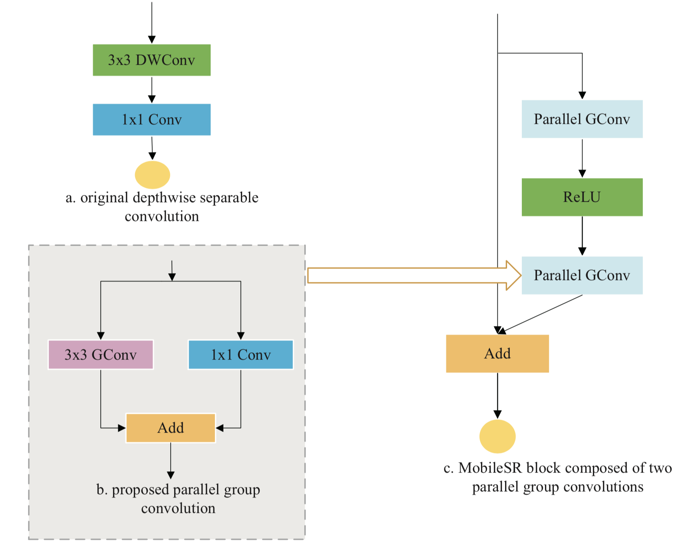
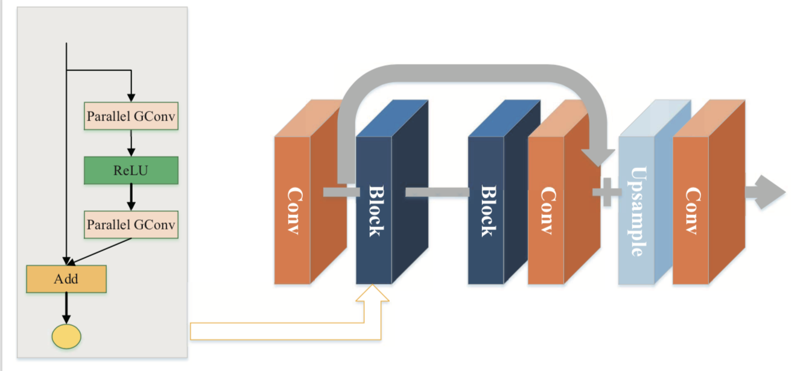

MobileSR
------
------
Introduction
----
We describe an efficient super-resolution network, MobilSR, and proposes a newly-devised convolution, parallel- group convolution. Parallel-group convplution divides standard convolutions into four groups and introduces a shortcut of 1×1 convolution. It achieves approximate performance but reduces the number of parameters by four times compared to a standard convolution.
* parallel group convolution

* network

* performance


Code
----
Clone this repository into any place you want.
```Bash
git clone https://github.com/DestinyK/MobileSR
cd MobileSR
```
We refer to this [EDSR code](https://github.com/thstkdgus35/EDSR-PyTorch)

Start
----
```Bash
cd src
sh demo.sh
```
You can find the result images from experiment/test/results folder.

Datasets
-----
We used [DIV2K](http://www.vision.ee.ethz.ch/~timofter/publications/Agustsson-CVPRW-2017.pdf) dataset to train our model. Please download it from [here](https://cv.snu.ac.kr/research/EDSR/DIV2K.tar) (7.1GB).

You can evaluate your models with widely-used benchmark datasets:

[Set5 - Bevilacqua et al. BMVC 2012,](http://people.rennes.inria.fr/Aline.Roumy/results/SR_BMVC12.html)

[Set14 - Zeyde et al. LNCS 2010,](https://sites.google.com/site/romanzeyde/research-interests)

[B100 - Martin et al. ICCV 2001,](https://www2.eecs.berkeley.edu/Research/Projects/CS/vision/bsds/)

[Urban100 - Huang et al. CVPR 2015.](https://sites.google.com/site/jbhuang0604/publications/struct_sr)
